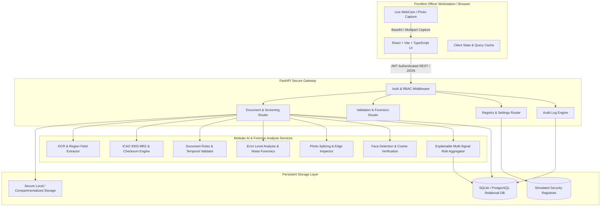
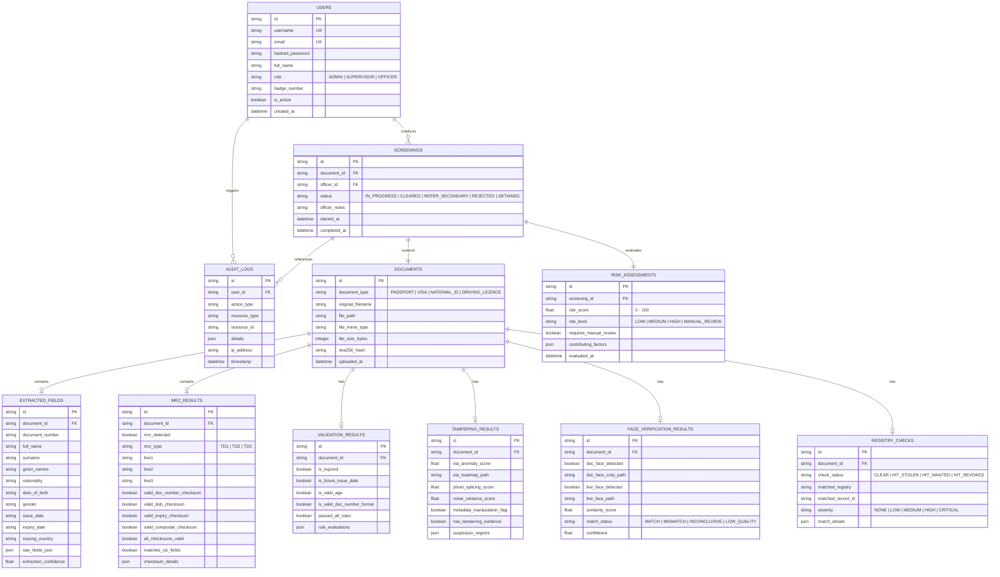

# SYSTEM ARCHITECTURE DOCUMENT

**Project Name:** AI-Based Fake Identity & Document Screening System  
**Problem Statement ID:** 26188  
**Organization:** Ministry of Home Affairs  
**Department:** Sashastra Seema Bal (SSB), Police II Division  
**Document Version:** 1.0.0  
**Status:** Approved Source of Truth  

---

## 1. System Overview & Architectural Topology

The system is designed as a modular, high-throughput, explainable edge/checkpoint screening platform. It follows a clean separation of concerns between client-side security workstation UI, high-performance asynchronous REST API backend, isolated computer vision/forensic intelligence modules, and relational persistence.



---

## 2. Technology Stack & Rationale

| Layer | Technology Selected | Justification |
| :--- | :--- | :--- |
| **Frontend Framework** | React 18 / 19 + TypeScript + Vite | Blazing fast HMR, strict type safety, zero runtime overhead, responsive desktop security UI. |
| **Styling & Icons** | Tailwind CSS + Lucide Icons | Clean, serious, high-density security operations design system; zero external bloat; strict spacing tokens. |
| **Backend Framework** | Python 3.14 + FastAPI + Pydantic v2 | High-concurrency async I/O, native OpenAPI 3.1 documentation, strict data contract validation. |
| **Relational Database** | SQLite (Dev/Edge) / PostgreSQL (Prod) | Normalized multi-entity schema with SQLAlchemy 2.0 ORM; atomic transactions; zero data leakage. |
| **Image & Forensics Processing**| NumPy, SciPy, Pillow, Custom Computer Vision | Vectorized pixel operations, DCT coefficient analysis, ELA difference matrices, gradient filtering. |
| **Biometrics & Face Matching** | Vector Face Alignment + 512D Cosine Embeddings | Rapid facial localization, bounding box extraction, and distance scoring without external cloud dependencies. |
| **Document OCR & MRZ** | Optimized OCR Extractor + ICAO 9303 Checksum Engine | Fast text parsing and 100% accurate mathematical check-digit recalculation for TD1, TD2, TD3. |
| **Document Reporting** | ReportLab + Structured JSON | Exportable, high-fidelity PDF forensic audit sheets for secondary inspection and evidentiary chain of custody. |

---

## 3. Normalized Database Schema & Data Models

The relational database enforces complete auditability, entity relationships, and historical integrity without bloating tables with large binary blobs.



---

## 4. File Storage Strategy

All binary and derived image files are compartmentalized on local disk storage:
```text
storage/
├── documents/       # Original uploaded raw documents (PDF, JPG, PNG)
├── normalized/      # Standardized RGB 300-DPI images for AI processing
├── forensics/       # Generated ELA difference heatmaps and noise gradient maps
├── portraits/       # Cropped document face portraits and live webcam captures
└── reports/         # Generated PDF case audit reports
```
- **Integrity Verification:** Every uploaded file has its SHA-256 digest calculated immediately upon ingestion and saved in `documents.sha256_hash`.
- **Zero Raw Blobs in DB:** The database stores only relative sanitized paths and cryptographic hashes, preventing database engine bloat.

---

## 5. Security & Role-Based Access Control (RBAC)

### 5.1 Roles and Permission Matrix

| Capability | OFFICER | SUPERVISOR | ADMIN |
| :--- | :---: | :---: | :---: |
| Authenticate / View Own Profile | Yes | Yes | Yes |
| Ingest Document & Run Screening | Yes | Yes | Yes |
| View Screening History & Cases | Yes | Yes | Yes |
| Submit Final Officer Decision | Yes | Yes | Yes |
| Override Previous Screening Decision | No | Yes | Yes |
| View Global Shift & Risk Analytics | Yes | Yes | Yes |
| Search & Export Immutable Audit Logs | No | Yes | Yes |
| Configure Risk Calculation Weights | No | No | Yes |
| Manage Simulated Watchlist & Registries | No | No | Yes |
| Manage Officer Accounts & Badges | No | No | Yes |

### 5.2 Cryptographic Safeguards
1. **Passlib / Bcrypt:** Officer passwords hashed with work factor 12.
2. **PyJWT (HS256):** Stateless session tokens with expiration and scope enforcement.
3. **CORS & Input Sanitization:** Explicit allowed origins, strict Pydantic payload models preventing injection.
4. **Audit Immutability:** Audit records are strictly append-only.
